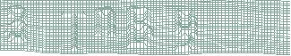
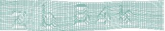

# Python Grid Captcha Generator

### Installation

    pip install grid_captcha

Or download the tarball / `git clone` and...

    python setup.py install

### Usage
```python
from grid_captcha import CaptchaBuilder

builder = CaptchaBuilder()  # Create builder
builder.build()  # Generate new image

word = builder.word

builder.show()

builder.save('1.jpeg')

image_jpeg = builder.base64()
image_png = builder.base64(image_format='PNG')
```

### Examples








